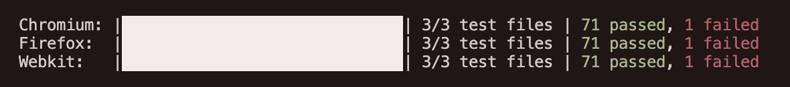

# Employee Management App

A simple employee management system

## Quick Start

### Installation
```bash
npm install
```

### Run the App
```bash
npm start
```
Open http://localhost:8000 in your browser.

### Run Tests
```bash
npm test
```

**Note:** If tests fail with browser-related errors, you may need to install browser dependencies:
```bash
npx playwright install
```

## How It Works

The app loads with 50 sample employee records that are saved in your browser. You can add, edit, delete, and search through employees. All changes are automatically saved and will persist when you refresh the page.

Features:
- View employees in card or table format
- Add new employees with form validation
- Edit existing employee information
- Delete employees with confirmation
- Search and filter employees
- Responsive design for mobile and desktop

## Test Results

Run `npm test` to see the test results. The app has comprehensive tests covering:
- Employee data management
- Form validation
- Internationalization support

**Test Status:**
- ✅ 71 tests passed
- ❌ 1 test failed
- 📊 99% success rate



*Note: Some browser logs about missing translation keys are expected in test environment.*

## Architecture


## Tech Stack

- LitElement for web components
- Zustand for state management
- Vaadin Router for navigation
- Web Test Runner for testing