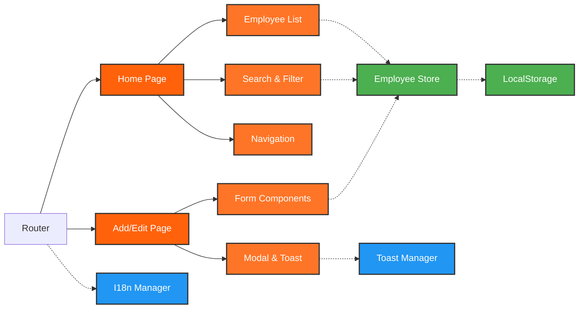

# Employee Management App - Architecture Diagram

## Architecture Overview

### 🏗️ **Architecture:**
- **Pages** - Home (Employee List) & Add/Edit Employee
- **Components** - Reusable UI elements (Forms, Navigation, etc.)
- **State Management** - Zustand store with LocalStorage persistence
- **Utilities** - I18n & Toast management

### 🔄 **Data Flow:**
- **Solid arrows** → Component relationships
- **Dotted arrows** → Data flow
- **Color coding** → Different layers

### ✨ **Key Features:**
- **SPA Routing** - Vaadin Router for navigation
- **State Management** - Zustand with LocalStorage persistence
- **Internationalization** - Multi-language support (TR/EN)
- **Responsive Design** - Mobile-first approach
- **Component Architecture** - Modular, reusable components

### 🎨 **Brand Colors:**
- **Primary**: #FF620B (Orange)
- **Secondary**: #FF7527 (Light Orange)
- **Success**: #4CAF50 (Green)
- **Info**: #2196F3 (Blue)
